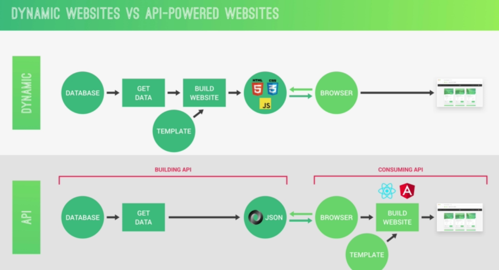

## Node JS

#### Node JS commands

- .break Sometimes you get stuck, this gets you out
- .clear Alias for .break
- .editor Enter editor mode
- .exit Exit the repl
- .help Print this help message
- .load Load JS from a file into the REPL session
- .save Save all evaluated commands in this REPL session to a file
- ctr + d to exist node terminal

#### How to write your first code in Node JS

- create a index.js file in your folder
- Write the following code

```js
const hello = 'Hello World';
console.log(hello);
```

- Open your terminal and write

```js
node index.js
```

#### Congratulations you just created your first line of code in Node JS

---

#### node module - used to store the functionality of a function. Example file system (fs) module for reading and writing data.

#### How to use this module

- You require the module
- Store it in a variable

#### How read files

- Use file system module and store it in a variable.

```js
const fs = require('fs');
```

- Use Synchronous read file function, that reads the entire contents of a file. The input will be the path to your file and utf8 character encoding.

```js
const text = fs.readFileSync('./txt/input.txt', 'utf8');
console.log(text);

// in the terminal run node index.js(file with the code) and you will see the text as the output.
```

#### How to write files

- Store your code in a variable.

```js
const hello = 'Hello World! I am finally ready to learn Node!';
```

- Use the file system module and the write file sync function that Synchronously writes data to a file or replacing the file if it already exist.

```js
//you have to specify the file path and the code you want to write

fs.writeFileSync('./txt/output.txt', hello);
```

#### Let's understand the difference between Synchronous and asynchronous coding

- Synchronous coding is when code can only run if the previous code is executed. This can cause problems if you have code that takes too long to execute. \
  It's even worse if you have a lot of users in your application. Simple functionality like logining in or reading othe feeds will be dealed. This is also called blocking method.

```js
const text = fs.readFileSync('./txt/input.txt', 'utf8');
console.log(text);
```

- Asynchronous is when heavy code that take longer to execute is done at the background as the other code runs in the application. When the longer code is done, it's called through a callback function that runs the result/output of the previous code. This is also called non-blocking.

```js
fs.readFileSync('./txt/input.txt', 'utf8', (err, data) => {
  console.log(data);
});
console.log('Asynchronous code');
```

#### Single thread in node JS

- In node JS process there is only one Single thread.\
  A thread is a set of instructions that runs our code in the machine processor. Hence in every node application there is one thread that all your users are using. If one user runs a Synchronous code that takes a few seconds, the rest of the users will have to wait until the code is executed. \
  This can be a pain if your application has thousands of users because all functionality of the application will stop working asynchronously and wait until for the previous code is executed. \
  That's why asynchronous method is preferred over synchronous method in node applications.

---

#### How to make a simple web server in node

```js
const http = require('http');

const server = http.createServer((req, res) => {
  console.log(req);
  res.end('Hello from server! 😍');
});

server.listen(8000, '127.0.0.1', () => {
  console.log('Server listening! 💣');
});
```

---

## Rounting

#### What is rounting?

This is implementing different actions for different urls.
You can use the if else statement to direct actions to the urls inside the createServer callback function.

```js
const pathName = req.url;
const server = http.createServer((req, res) => {
  if (pathName === '/' || pathName === '/overview') {
    res.end('This is from overview!😍');
  } else if (pathName === '/product') {
    res.end('This is from product!');
  } else {
    res.writeHead(404, {
      'Content-type': 'text/html ,charset=utf-8',
      'my-own-header': 'hello-world',
    });
    res.end('<h1>Page not found!</h1>');
  }
});

server.listen(8000, '127.0.0.1', () => {
  console.log('Server listening! 💣');
});
```

---

### How to make a simple API

API is the acronym for Application Programming Interface, which is a software intermediary that allows two applications to talk to each other.
Api a service we can request some data.

#### How to request data as a user with one API call.

- Use the if statement to match the request api url.

```js
if (pathName === '/api') {
}
```

- Create a file system function that runs once to read the data. Hence you will use the sync file system function. When the application first runs, it will read the json data once and when the user enters the api route, it will send back the data upon request.\
  It's a good practice to use dirname variable to locate the directory where the script is. \
  To use the json data in html you have to use JSON.parse to convert the JSON string data to javascript and store it in a variable.

```js
const data = fs.readFileSync(`${__dirname}/dev-data/data.json` 'utf-8');
const objData = JSON.parse(data);
```

- Send the data to the browser as a response by using res.end method.
- Tell the browser that your data is JSON, use res.writeHead method.

```js
const pathName = req.url;

const data = fs.readFileSync(`${__dirname}/dev-data/data.json`, 'utf-8');
const objData = JSON.parse(data);

const server = http.createServer((req, res) => {
  if (pathName === '/api') {
    res.writeHead(200, { 'Content-Type': 'application/json' });
    res.end(data);
  } else {
    res.writeHead(404, {
      'Content-type': 'text/html ,charset=utf-8',
      'my-own-header': 'hello-world',
    });
    res.end('<h1>Page not found!</h1>');
  }
});

server.listen(8000, '127.0.0.1', () => {
  console.log('Server listening! 💣');
});
```

#### HTML templates

- Start by replacing the text you want to add dynamically with data later on.

```html
<h2 class="product__name"></h2>
<div class="product__details">
  <p><span class="emoji-left">🌍</span> From </p>
  <p><span class="emoji-left">❤️</span> </p>
  <p><span class="emoji-left">📦</span> </p>
  <p><span class="emoji-left">🏷</span> €</p>
</div>
```

- For the links you with use the id number that you stored in the json data. Because the data is stored in an array it will be best to start with id = "0". Instead of using the # inside the href, you will add the api route and id number.

```html
<a class="card__link" href="/product?id=">
  <span>Detail <i class="emoji-right">👉</i></span>
</a>
```

//////Filing the templates

- Make sure the templates are read during initialization of the application. You can use sync file system function which is a blocking method and store it in a variable. But because it will run only once when the application is running not when the createServer callback function is called.

```js
const tempOverview = fs.readFileSync(
  `${__dirname}/templates/template-overview.html`,
  'utf-8'
);
const tempCard = fs.readFileSync(
  `${__dirname}/templates/template-card.html`,
  'utf-8'
);
const tempProduct = fs.readFileSync(
  `${__dirname}/templates/template-product.html`,
  'utf-8'
);
```

- In the createServer callback function tell the browser the type of information it's about to receive by using witeHead function.
- Loop through the JSON data with map method that will return replaceTemplate function that has individual data from the json data array and the card template.

```js
if (pathname === '/' || pathName === '/overview') {
  //tells the browser the type of information it's about to receive
  res.writeHead(200, { 'content-type': 'text/html' });

  const cardHtml = objData
    .map((obj) => replaceTemplate(tempCard, obj))
    .join('');
  const output = tempOverview.replace('', cardHtml);
  res.end(output);
}
```

- Inside the replaceTemplate function you can use replace method to replace the placeholder text with the data.
- You can use regular expression to make sure the placeholder text is selected globally through out your project.

```js
const replaceTemplate = (card, product) => {
  let output = card.replace(//g, product.productName);
  output = output.replace(//g, product.image);
  output = output.replace(//g, product.from);
  output = output.replace(//g, product.nutrients);
  output = output.replace(//g, product.quantity);
  output = output.replace(//g, product.price);
  output = output.replace(//g, product.description);
  output = output.replace(//g, product.id);

  if (!product.organic)
    output = output.replace(//g, 'not-organic');
  return output;
};
```

- For the url, you can use the url module. Then use url.parse method and pass req.url as an argument. As a result you will get a query object that tells you the id index.

```js
const { query, pathname } = url.parse(req.url, true);
```

```js
query: {id = "0"},
pathname : "/overview"
```

- Use the query id to get the individual data for each element.

```js
const product = objData[query.id];
```

### NPM install

#### Types of packages

- Dependency packages
- Development dependencies

#### What is the difference between dependency and dev dependencies packages

Dependency modules are required during the runtime while dev dependencies are required during the development.

#### Slugify

Helps us to make more readable urls from names.

#### How to install a dependency

```json
npm install slugify --save
//or
npm i slugify
```

#### How to install a dependency

```json
npm install nodemon --save-dev
//or
npm i nodemon -D
```

#### What is nodemom

[Nodemon](https://nodemon.io/) is a utility that will monitor for any changes in your source and automatically restart your server.
Instead of using node index.js to run your code nodemon watches for changes and automatically restarts your Node application . This is better than manually restarting it with node.

#### npm packages

Npm packages follow the semantic version notation. The version of npm packages have the three version numbers : major, minor, patch.

```json
//install a specific npm package
npm i slugify@!.0.0
//Check for outdated npm packages
npm outdated
//update npm packages
npm update slugify || npm update
```

#### How the web Works

The user/client types in the url of a webpage in a browser, the request is sent to the server where the website is hosted then the server sends back the response by getting the webpage content to the client. This is called client-server architecture or Resquest reponse model.

1. First when your enter the domain name it is sent back to DNS Domain Name Server where it gets the real IP address of the website.
   //https://www.google.com/maps to https://216.58.211.206:443. The protocol is http|| https, IP address is 216.58.211.206 and port number is 443 for https || 80 for http.

2. A TCP/IP socket connection is established between the server and the client. TCP is the Transmission Control Protocol and IP is the Internet Protocol, they ddefine how data travels across the web. They set the rules on how data moves across the internet.

3. The Http request is sent to the server. HTTP is Hyper Text Transmission Protocol which is a communication protocol that allows two or more systems to communicate. Http is a protocol that allows the client and server to communicate by sending and receiving messages.
   Types of HTTP methods: (GET/maps HTTP/1.1)

- GET - for requesting data
- post - for sending data
- patch - for modifying data
  The HTTP request has the :
- Start line contains: Http method, request target and http version.
- Http request header has contains Host : www.google.com, User-Agent: Mozilla/5.0 and Accepted language - en-us
- Body response only when it's sending data to the server. (POST)

4. A HTTP response is sen back from the server.
   The http response contains:(HTTP/1.1 200 ok)

- Start line with http version, status code and status message.
- Response message
- response body

5. The TCP breaks the HTTP request and response into small chunks called packets before they are sent, then it assemble them into their original request and response. The IP protocol sends and routes all the packets through the internet. It makes sure the packets goes back to their respetive IP addresses.



(Amazing notes I take for Jonas course)
